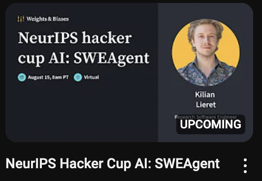

# SWE Agent baseline

The full tutorial is here https://princeton-nlp.github.io/SWE-agent/usage/coding_challenges/


To get yous started we have a YouTube video from the HackerCup Lectures on how to use this starter kit:
[](https://www.youtube.com/watch?v=d9gcXpiiDao)

This baseline got about 1/3 of the Dim Sum test cases correctly with no tuning but failed to find the "trick"

But here's some helpful tips we found when getting this baseline to work
1. When you create a `problem.md` make sure to include the problem statement, sample_in, sample_out and the full input in the same file
2. The agent will essentially iteratively create a git repo for you so make sure you've ran `git init` in an empty folder and committed a `main.py` file
3. You will need to set your keys in a file called `keys.cfg` inside the SWE-Agent repo
4. You will need docker installed and if that's not available to you, you may run https://github.com/princeton-nlp/SWE-agent/issues/13#issuecomment-2102820622

## Solution

On https://www.facebook.com/codingcompetitions/hacker-cup/2023/practice-round/problems/B - the agent got about 1/3 of the test cases right which is not great! Since the choices are yes/no a random gues would be a better strategy.

```python
import sys
from math import gcd

def has_winning_strategy(R, C, A, B):
    # Alice wins if she can avoid the losing positions
    return (R-1) % (A+1) != A or (C-1) % (B+1) != B

def main():
    T = int(input().strip())
    for case_num in range(1, T + 1):
        R, C, A, B = map(int, input().strip().split())
        result = "YES" if has_winning_strategy(R, C, A, B) else "NO"
        print(f"Case #{case_num}: {result}")

if __name__ == "__main__":
    main()
```

But the correct solution had a "trick"

```python
def has_winning_strategy(R, C, A, B):
    # Alice wins if and only if R > C
    return R > C

def main():
    with open('input.txt', 'r') as input_file, open('output.txt', 'w') as output_file:
        lines = input_file.readlines()
        T = int(lines[0].strip())  # Number of test cases

        for case_num, line in enumerate(lines[1:], 1):
            try:
                R, C, A, B = map(int, line.strip().split())
                result = "YES" if has_winning_strategy(R, C, A, B) else "NO"
                output_file.write(f"Case #{case_num}: {result}\n")
            except Exception as e:
                print(f"Error processing case {case_num}: {line.strip()}")
                print(f"Error message: {str(e)}")

            if case_num == T:
                break  # Stop after processing T cases

if __name__ == "__main__":
    main()
```

## Improving the baseline

* Update the demonstration trajectory: https://princeton-nlp.github.io/SWE-agent/config/demonstrations/
* Update the "tips" and directions sections here: https://github.com/princeton-nlp/SWE-agent/blob/main/config/coding_challenge.yaml
