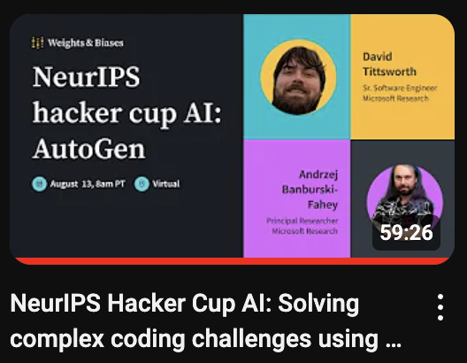

# AutoGen HackerCup Code Sample

To get yous started we have a YouTube video from the HackerCup Lectures on how to use this starter kit:
[](https://www.youtube.com/watch?v=jCq7oI54R_s)


Recommended tools:
- Docker

## Building and Running Docker Image


Add a file named `.env` inside `/autogen` folder with at a minimum the following content:
```bash
OAI_API_KEY=<oai_api_key> 
OAI_ORGANIZATION=<oai_org>
OAI_MODEL=<oai_model>  # *optional* (default gpt-4o) 
OAI_BASE_URL=<oia_url> # *optional* 
OAI_API_VERSION=<oia_version> # *optional*
OAI_API_TYPE=<oai_type> # *optional* (default "openai")

VISION_OAI_MODEL=<oai_model> #*optional* (default gpt-4o) 
VISION_OAI_ORGANIZATION=<oai_org> # *optional* 
VISION_OAI_API_KEY=<oai_api_key> # *optional* 
VISION_OAI_BASE_URL=<oia_url> #* optional
VISION_OAI_API_VERSION=<oia_version> # *optional*
VISION_OAI_API_TYPE=<oai_type> # *optional* (default "openai")
```
Image agent (vision capability) is enabled if `VISION_OAI_API_KEY` is provided.

see [LLM Config](https://microsoft.github.io/autogen/docs/topics/llm_configuration/) for more info.

Running a py script  will throw an error without required envs. Check [Config](./app/config/config.py) for more configuration options.

In the root folder run the following to build
```bash
docker build -f ./Dockerfile -t autogen_dev_img .
```
*Note: Once the image is built, no need to rebuild image unless changes are made to `Dockerfile`*

After image is built, run the docker image with either simple or complex example. Running the sample HackerRank data :

```bash 
docker run --env-file ./.env  -it -v "$(pwd)/app:/home/autogen/autogen/app" -v "$(pwd)/../assets/practice:/home/autogen/autogen/app/assets" autogen_dev_img:latest python /home/autogen/autogen/app/hackercup.py /home/autogen/autogen/app/assets/
```

- The simple example using multiple agents in a coding scenario, which is a good place to start with AutoGen and coding agents:

`docker run --env-file ./.env  -it -v "$(pwd)/app:/home/autogen/autogen/app" autogen_dev_img:latest python /home/autogen/autogen/app/simple.py`

- A more complex agent is defined in `groupchat_agents.py`

More info on Docker installation with AutoGen:  https://microsoft.github.io/autogen/docs/installation/Docker/


## Data Ingest
Example data is located in [/assets](../assets/) and contain two 2023 HackerRank Problems:
- [Cheeseburger Corollary 1](https://www.facebook.com/codingcompetitions/hacker-cup/2023/practice-round/problems/A1)
- [Cheeseburger Corollary 2](https://www.facebook.com/codingcompetitions/hacker-cup/2023/practice-round/problems/A2)
- [DimSum Delivery](https://www.facebook.com/codingcompetitions/hacker-cup/2023/practice-round/problems/B)
- [Two Apples a Day](https://www.facebook.com/codingcompetitions/hacker-cup/2023/practice-round/problems/C)
- [Road To Nutella](https://www.facebook.com/codingcompetitions/hacker-cup/2023/practice-round/problems/D)

The current implementation will solve Cheeseburger Corollary 1 but may fail on harder problems.
For each problem, you'll find these files:

* `<problem_name>.md`: The problem statement formatted in Markdown
* `<problem_name>.in`: The full input file
* `<problem_name>.out`: The full output file
  * Note that some problems accept multiple possible outputs, in which case the full output file is simply an example of an output that would be accepted
* `<problem_name>_sample_input.txt`: The sample input provided by the problem statement
* `<problem_name>_sample_output.txt`: The sample output provided by the problem statement

For full dataset, please visit the [Hackercup HuggingFace dataset](https://huggingface.co/datasets/hackercupai/hackercup)


## Agent Flow

The sequence of agents are as followed: 
- Program manager
    - initiates and manages conversations
- Image explainer
    - creates captions for any images in the problem
- Group Manager
    - Problem analyst: define the objective and scope problem
    - Solution architect: create feasible solution 
    - Logic critic: verify solution created by Solution architect 
    - Coder: implement solution with code
    - Code critic: examines solution, note this does not check outputs currently


## Output
Creates `<problem_id>_generated_code.txt` which will takes input filepath and typically generates and file outputs. These outputs can later be validated.

For the competition, only inputs will be provided.


### Responsible AI
This code is built on top of the [AutoGen](https://github.com/microsoft/autogen) library and inherits the same capabilities and limitations as AutoGen. For more information, please check out AutoGen's [TRANSPARENCY_FAQS](https://github.com/microsoft/autogen/blob/main/TRANSPARENCY_FAQS.md)
