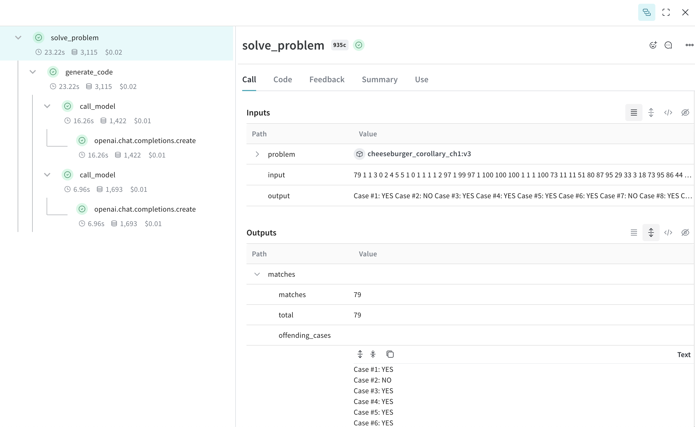

# Hacker Cup AI Starter Solution

This folder contains a basic starter kit for solving Hacker Cup problems using AI. It includes scripts for downloading the dataset and generating solutions using an AI model.

## Contents

- `01_one_shot.py`: Main script for generating solutions using an AI model
- `download.py`: Script for downloading the Hacker Cup dataset
- `utils.py`: Utility functions (not shown in the provided code snippets)

## Getting Started

### 1. Download the Dataset

First, use the `download.py` script to fetch the Hacker Cup dataset for a specific year:

```bash
python download.py --year 2023 --dataset_folder dataset
```

This will download the problems for the specified year to the `dataset` folder.

### 2. Generate Solutions

The `01_one_shot.py` script demonstrates how to use an AI model (GPT-4 in this example) to generate solutions for Hacker Cup problems. To use this script:

1. Set up your OpenAI API key in your environment.
2. Install the required dependencies (openai, weave, and any others mentioned in the imports).
3. Modify the `SAMPLE_PATH` variable to point to the problem folder you want to solve.
4. Run the script:

```bash
python 01_one_shot.py --problem_name road_to_nutella --folder_path "./dataset/2023/practice/"
```

This script will:
- Load the problem from the specified folder
- Generate a solution using the AI model
- Check the solution against the input

## Customization

You can customize the behavior of the solution generator by modifying:

- The `system_prompt` to change the AI's role and task description
- The `prompt_template` to alter how the problem is presented to the AI
- The model used in the `call_model` function (currently set to "gpt-4")

## Weave Logging Support

Debugging can be tricky when interacting with AI models. Weave logging support is provided to help with this.

```bash
python 01_one_shot.py --problem_name road_to_nutella --folder_path "./dataset/2023/practice/" --weave_log
```



Check [Weave's documentation](https://wandb.github.io/weave/) for more information on how to use Weave tracing.

## Note

This is a basic starter solution. Feel free to modify and improve upon it to create more sophisticated approaches for solving Hacker Cup problems.

Remember to comply with the competition rules and guidelines when using and submitting solutions generated by AI models.