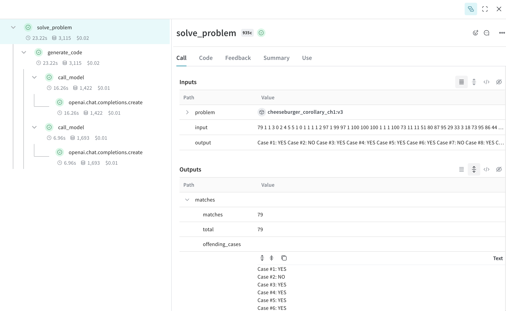

# Hacker Cup AI Starter Solution

This folder contains a basic starter kit for solving Hacker Cup problems using AI. It includes scripts for downloading the dataset and generating solutions using an AI model.

To get yous started we have a YouTube video from the HackerCup Lectures on how to use this starter kit:
[](https://www.youtube.com/watch?v=90FVRHOP9xY)

## Contents

- `01_one_shot.py`: Main script for generating solutions using an AI model
- `download.py`: Script for downloading the Hacker Cup dataset
- `utils.py`: Utility functions (not shown in the provided code snippets)

## Getting Started

### 1. Download the Dataset

First, use the `download.py` script to fetch the Hacker Cup dataset for a specific year:

```bash
python download.py --year 2023 --dataset_folder dataset
```

This will download the problems for the specified year to the `dataset` folder.

### 2. Generate Solutions

The `01_one_shot.py` script demonstrates how to use an AI model (GPT-4 in this example) to generate solutions for Hacker Cup problems. To use this script:

1. Set up your OpenAI API key in your environment.
2. Install the required dependencies (openai, weave, and any others mentioned in the imports).
3. Modify the `SAMPLE_PATH` variable to point to the problem folder you want to solve.
4. Run the script:

```bash
python 01_one_shot.py --problem_name road_to_nutella --folder_path "./dataset/2023/practice/"
```

This script will:
- Load the problem from the specified folder
- Generate a solution using the AI model
- Check the solution against the input

## Evaluation

The `02_run_and_eval.py` script demonstrates how to evaluate the solution generated by the AI model. To use this script:

```bash
# 2023 practice problem
python 01_one_shot.py --problem_name road_to_nutella --folder_path "./dataset/2023/practice/"

# 2024 round 1
python 01_one_shot.py  --problem_name "Prime Subtractorization" --folder_path dataset/2024/round1
```
> Note that 2024 has a different folder structure with one problem per folder.

This script will:
- Load the problem from the specified folder
- Evaluate the solution generated by the AI model
- Print the evaluation results

Some key params are:
- `--model`: OpenAI model to use (default is "gpt-4o")
- `--timeout`: Timeout for the evaluation (default is 60 seconds)


## Customization

You can customize the behavior of the solution generator by modifying:

- The `system_prompt` to change the AI's role and task description
- The `prompt_template` to alter how the problem is presented to the AI
- The model used in the `call_model` function (currently set to "gpt-4")

## Weave Logging Support

Debugging can be tricky when interacting with AI models. Weave logging support is provided to help with this.



Check [Weave's documentation](https://wandb.github.io/weave/) for more information on how to use Weave tracing.

# Evaluation External Solutions (Bring your own)

You can generate your `.out` solution using your own fancy agentic tool and jut run the evaluation here:

The `03_eval_solutions.py` script is used to evaluate external solutions. To use this script:

```bash
python 03_eval_solutions.py --help
usage: 03_eval_solutions.py [-h] [--code str] [--input str] [--output str] [--eval_name str] [--weave_project str]
                            [--timeout float] [--suffix str] [--verbose bool] [--folder str] [--run_samples bool]
                            [--cpp_version int]

options:
  -h, --help            show this help message and exit

Args ['config']:
  Args(code: str = 'dataset/2023/practice/cheeseburger_corollary_ch1.cpp', input: str = 'dataset/2023/practice/cheeseburger_corollary_ch1.in', output: str = 'dataset/2023/practice/cheeseburger_corollary_ch1.out', eval_name: str = 'super_dupper_model', weave_project: str = 'hackercup-eval-solution', timeout: float = 30, suffix: str = '_generated_output.txt', verbose: bool = False, folder: str = None, run_samples: bool = False, cpp_version: int = 11)

  --code str            The file to run (default: dataset/2023/practice/cheeseburger_corollary_ch1.cpp)
  --input str           The input to run the program on (default: dataset/2023/practice/cheeseburger_corollary_ch1.in)
  --output str          The output to compare against (default: dataset/2023/practice/cheeseburger_corollary_ch1.out)
  --eval_name str       The name of the evaluation (default: super_dupper_model)
  --weave_project str   The name of the weave project (default: hackercup-eval-solution)
  --timeout float       The timeout for the program execution (per problem) (default: 30)
  --suffix str          The suffix for the generated output file (default: _generated_output.txt)
  --verbose bool, --noverbose bool
                        Whether to print verbose output (default: False)
  --folder str          Run all problems in this folder (default: None)
  --run_samples bool, --norun_samples bool
                        Whether to run on the sample input/output pairs (default: False)
  --cpp_version int     The C++ version to use for the program execution (default: 11)
```

## Running one file

```bash
python 03_eval_solutions.py --code dataset/2023/practice/cheeseburger_corollary_ch2.cpp \
--input dataset/2023/practice/cheeseburger_corollary_ch2.in \
--output dataset/2023/practice/cheeseburger_corollary_ch2.out

# Program passed: {'solved': True, 'runnable': True}
```

## Running all files in a folder

For example, you can run the 2023/round2 problems on the sample inputs/outputs:

```bash
python 03_eval_solutions.py --folder dataset/2023/round2 --run_samples

# {'model_output': {'runnable': {'true_count': 3, 'true_fraction': 0.6}},
#     'check_solution': {
#         'solved': {'true_count': 3, 'true_fraction': 0.6},
#         'runnable': {'true_count': 3, 'true_fraction': 0.6}
#     },
#     'model_latency': {'mean': 1.8528173923492433}
# }
```
and the corresponding [weave trace](https://wandb.ai/capecape/hackercup-eval-solution/weave/evaluations?peekPath=%2Fcapecape%2Fhackercup-eval-solution%2Fcalls%2F01920138-bff6-7e03-a223-e6c2035b2f2c)

You can change the suffix of the generated output file by using the `--suffix` flag.

```bash
python 03_eval_solutions.py --folder dataset/2023/round2 --run_samples --suffix "_fancy_agent.txt"
```

This tool is built so you can use it with your own fancy agentic LLM code. 

> Everything is contained in the single file `03_eval_solutions.py` so you can bring this script on your own codebase.

# Note

This is a basic starter solution. Feel free to modify and improve upon it to create more sophisticated approaches for solving Hacker Cup problems.

Remember to comply with the competition rules and guidelines when using and submitting solutions generated by AI models.